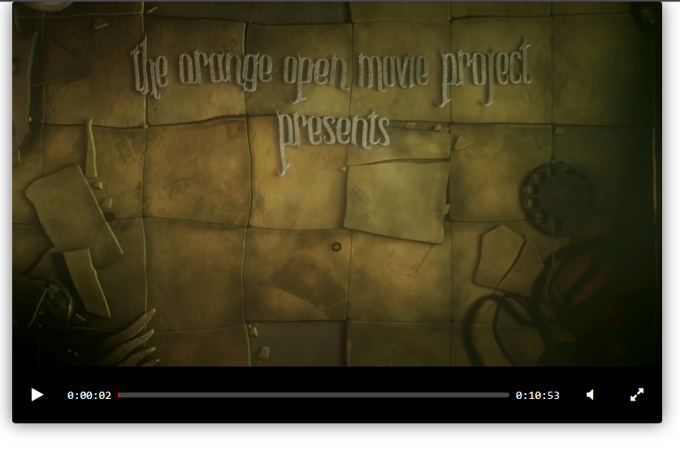

# ГОСТФильм — Видеоплеер

Простой видеоплеер, реализованный на HTML, CSS и JavaScript с использованием библиотеки [Playable](https://github.com/webpack-contrib/playable). Поддерживает воспроизведение видео, управление звуком, полноэкранный режим, а также отображение времени и прогресс-бара.

---

## Возможности

- Запуск/пауза видео
- Отключение и включение звука
- Переход в полноэкранный режим
- Отображение текущего времени и общей продолжительности
- Прогресс-бар с возможностью перемотки
- Адаптированный дизайн
- Поддержка клавиш управления
- Готов к публикации на GitHub Pages

---

## Скриншот



---

## Структура проекта

```
video-player-jslib/
├── favicon.png            # Иконка сайта (favicon)
├── index.html             # Главная HTML-страница с вёрсткой плеера
├── movie.mp4              # Видео, проигрываемое плеером
├── player.js              # JavaScript-логика для управления плеером
├── style.css              # Стили плеера
├── README.md              # Документация проекта
└── screenshots/
    └── screenshots.png    # Скриншот плеера для README
```

---

### Запуск локально

1. Убедитесь, что у вас установлен Python 3.
2. Запустите простой локальный сервер:

```bash
python3 -m http.server 8000
```

3. Перейдите в браузере по адресу:
[http://localhost:8000](http://localhost:8000)

---

## Публикация на GitHub Pages

Чтобы выложить сайт в интернет:

1. Создайте репозиторий на GitHub.
2. Добавьте все файлы и сделайте push.
3. В настройках репозитория (`Settings → Pages`) выберите ветку `main` и папку `/root` для публикации.
4. Получите ссылку вида:  
   `https://<ваш-логин>.github.io/<название-репозитория>/`

---

## Зависимости

Плеер использует:

- [Playable](https://github.com/webpack-contrib/playable) — плеер с гибким API
- [jQuery 3.6.0](https://code.jquery.com/jquery-3.6.0.min.js) — для простого DOM-управления
- [Font Awesome 4.7.0](https://cdnjs.com/libraries/font-awesome) — иконки управления

---

## Ссылка на сайт

[ГОСТФильм](https://tikhovskoy.github.io/video-player-jslib/) 